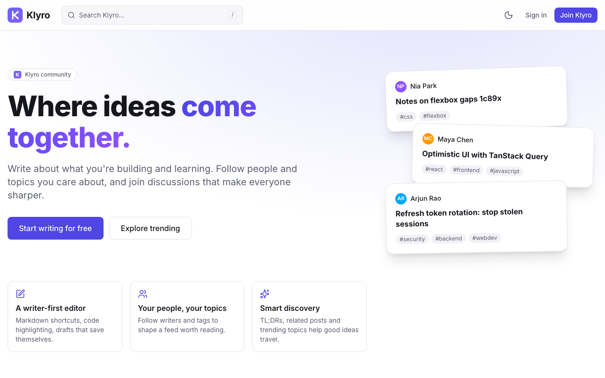
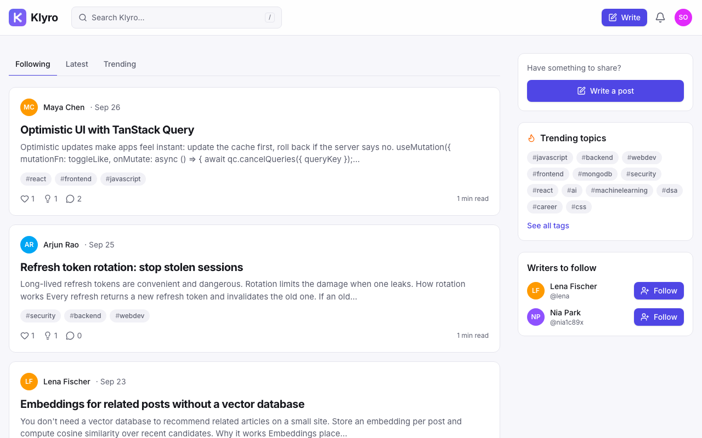
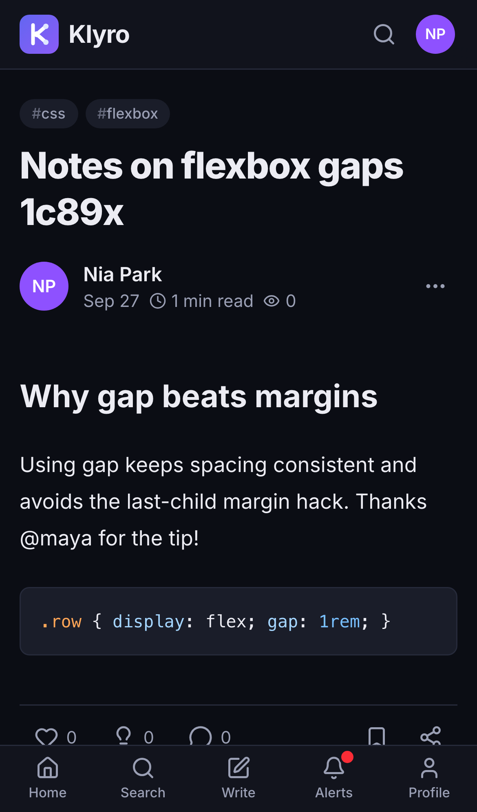
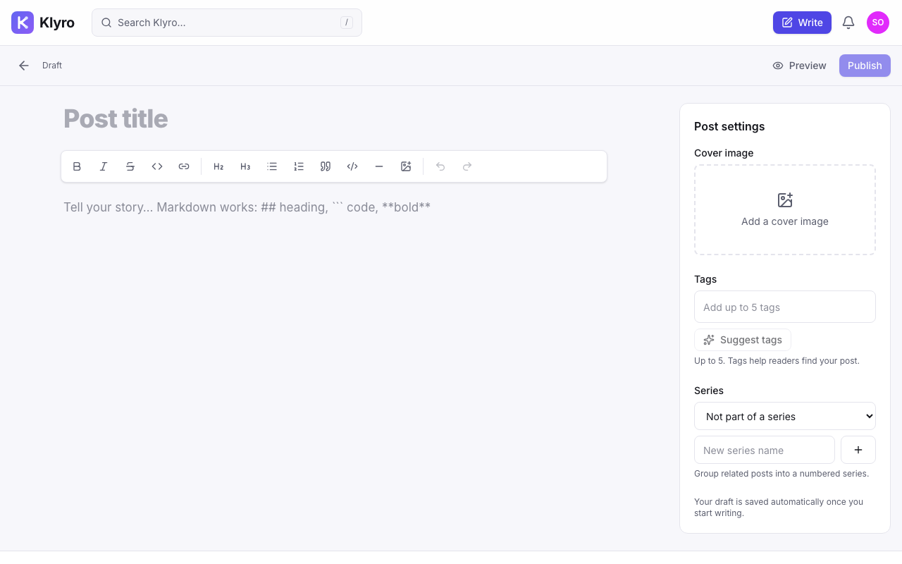
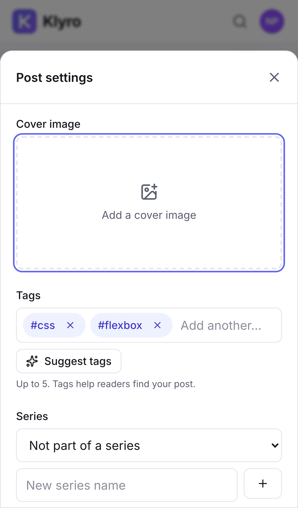
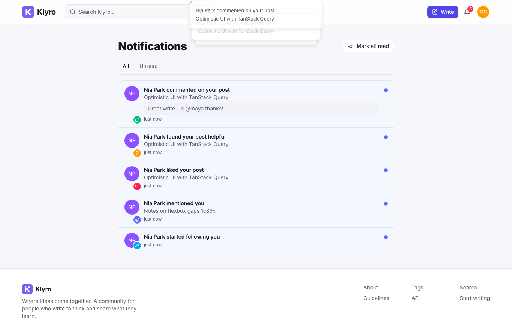
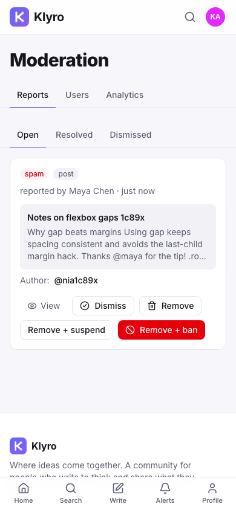
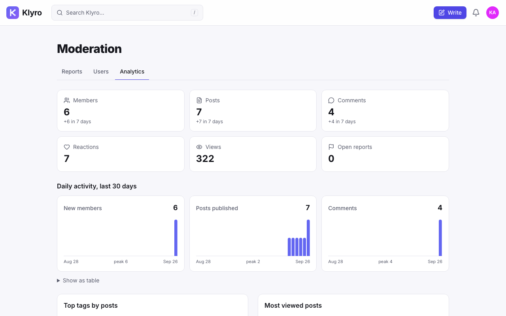
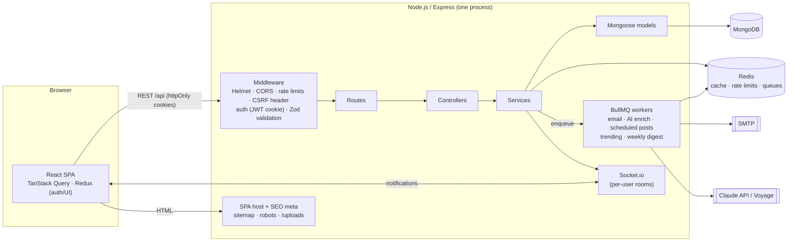

<p align="center">
  
</p>

<h1 align="center">Klyro</h1>
<p align="center"><strong>Where ideas come together.</strong></p>
<p align="center">A community blogging platform for developers and curious minds, built on MongoDB, Express, React and Node.js in TypeScript.</p>



Klyro started in 2024 as my 2nd-year college MERN blog. **v2** is a full rebuild into a production-quality community platform: anyone can write, readers follow people and topics, discussions are threaded, a moderation team keeps things healthy, and it works just as well on a phone as on a desktop.

> **Project status:** v2 lives on the [`v2` branch](https://github.com/Aakif9866/mern-blog/tree/v2) and is feature-complete and tested, but not deployed yet. The live site ([mern-blog-final.onrender.com](https://mern-blog-final.onrender.com)) still runs v1 from `main`, and `v1` is kept as a backup branch. What's done and what's next: [`docs/PROGRESS.md`](docs/PROGRESS.md).

---

## Contents

- [Features](#features)
- [Screenshots](#screenshots)
- [Tech stack](#tech-stack)
- [Architecture](#architecture)
- [Getting started](#getting-started)
- [Demo data](#demo-data)
- [Configuration](#configuration)
- [Scripts](#scripts)
- [Testing and quality](#testing-and-quality)
- [API](#api)
- [Security](#security)
- [Deployment](#deployment)
- [Upgrading from v1](#upgrading-from-v1)
- [Project structure](#project-structure)
- [Project timeline](#project-timeline)
- [Contact](#contact)
- [Roadmap](#roadmap)

---

## Features

**Writing**
- Rich editor (Tiptap) with Markdown shortcuts (`## heading`, ```` ``` ```` code, `**bold**`), Markdown paste, syntax-highlighted code blocks, links and image upload (paste or drag-and-drop)
- Drafts that autosave, a live preview, and scheduled publishing
- Up to five tags per post, with AI tag suggestions
- Series: group posts into numbered, navigable collections
- Cover images, read time and view counts
- Edit history for published posts, and soft delete
- All post HTML is sanitized on the server with an allow-list

**Community**
- Follow people and tags; public profiles with followers and following
- Two reactions, **Like** and **Helpful**, with optimistic UI
- Bookmarks, organised into collections
- Threaded comments and replies with `@mention` autocomplete
- Share menu (native share, copy link, X, LinkedIn, Reddit) and Open Graph / JSON-LD previews rendered on the server

**Discovery**
- **Following**, **Latest** and **Trending** feeds with infinite scroll. Trending weighs views, reactions, comments and bookmarks against age.
- Search across posts, people and tags, using MongoDB text search or Atlas Search, with prefix matching for search-as-you-type
- Tag pages, trending topics and related posts (embeddings)
- Onboarding that asks for interests and suggests writers

**Notifications**
- Notification center with read/unread state
- Real-time delivery over Socket.io for follows, reactions, comments, replies and mentions
- Email notifications (per-type preferences) and a weekly digest, sent by background jobs

**Guest mode**
- "Continue as guest" starts a temporary account in one click: guests can follow people and topics, react, bookmark and try the editor with autosaving drafts
- Publishing, commenting, reporting, uploads and AI features need a full account, which keeps spam out. Guest activity sends no notifications and guests don't appear in search.
- Guests can upgrade in place and keep everything. Otherwise the account and its data are deleted after 24 hours by a background job.

**Moderation**
- Report posts and comments; moderators work through a queue and can dismiss, remove, suspend or ban
- Roles: `user`, `moderator`, `admin`, with a strict hierarchy
- Analytics: totals, 7-day growth, 30-day activity charts, top tags and posts

**AI** (optional, degrades gracefully)
- TL;DR summaries of posts and AI tag suggestions via Claude
- Related posts via embeddings (Voyage AI, or a built-in local embedding when no key is set)

**Experience**
- Fully responsive from 320 px phones to large desktop monitors: bottom tab bar on phones, bottom-sheet dialogs, and no horizontal scrolling anywhere
- Dark mode (light / dark / system) applied before first paint
- Skeleton loaders, keyboard shortcut `/` for search, accessible labels and focus handling

## Screenshots

| Feed | Post (phone, dark mode) |
|---|---|
|  |  |
| **Editor** | **Post settings (phone)** |
|  |  |
| **Real-time notifications** | **Moderation queue (phone)** |
|  |  |
| **Analytics** | |
|  | |

## Tech stack

| Layer | Technology |
|---|---|
| Frontend | React 19, TypeScript, Vite, React Router, Tailwind CSS 4 |
| Client state | TanStack Query for server state; Redux Toolkit only for auth and UI state |
| Editor | Tiptap 3 + lowlight (highlight.js) |
| Backend | Node.js, Express 5, TypeScript |
| Validation | Zod (request bodies, queries, params and environment) |
| Database | MongoDB with Mongoose 9 (ObjectId relations, `populate`, compound/text/TTL indexes) |
| Cache and jobs | Redis, BullMQ (optional; falls back to in-process) |
| Real time | Socket.io |
| Email | Nodemailer (any SMTP; Mailpit locally) |
| AI | Anthropic Claude API, Voyage AI embeddings (both optional) |
| Logging | Pino |
| Docs | OpenAPI 3.1 generated from the route definitions, served with Swagger UI |
| Testing | Jest + Supertest + mongodb-memory-server (API), Vitest + React Testing Library (UI) |
| Tooling | ESLint, Docker, docker-compose, GitHub Actions |

## Architecture



**How a request flows**

1. The React app calls `/api/...` with credentials. Every state-changing request carries `X-Requested-With: klyro`, a CSRF defence: a cross-site page can't add that header without a CORS preflight, which only the app's own origin passes.
2. Global middleware applies security headers, CORS, compression, rate limits and the CSRF check, then attaches `req.user` if the access-token cookie is valid.
3. Each route declares its access level (`public`, `user`, `writer`, `moderator`, `admin`) and its Zod schemas. The same declaration generates the OpenAPI spec, so the docs can't drift from the code.
4. Controllers stay thin; **services** hold the business logic; **models** define schemas and indexes.
5. Slow or retryable work (email, AI summaries and embeddings, scheduled publishing, trending scores, the weekly digest) goes to BullMQ. Without Redis it runs in-process, so development needs only MongoDB.
6. Errors from anywhere end in one error handler that returns `{ success, statusCode, code, message, details? }`.

**Design choices worth knowing**

- **Cursor pagination** everywhere lists grow (feeds, comments, notifications, bookmarks, moderation). Cursors are opaque (`base64url({ value, id })`) and backed by compound indexes.
- **Denormalized counters** (likes, comments, followers…) keep feeds to one query; they're updated with `$inc` alongside the source write.
- **Redis cache** holds hot posts (60 s), the first page of each public feed (30 s), profiles and trending tags, and is invalidated on writes. Viewer-specific state is never cached.
- **Trending score** = `(views·0.1 + likes + helpful·2 + comments·1.5 + bookmarks·1.5 + 1) / (hours + 2)^1.5`, recomputed every 10 minutes for the last 30 days of posts.
- **Server-side SEO**: the SPA's `index.html` gets page-specific `<title>`, Open Graph, Twitter and JSON-LD tags for posts, profiles and tags, so link previews work without server-side rendering.

## Getting started

**Prerequisites:** Node.js 20.19+ (22 recommended) and Docker (or your own MongoDB).

```bash
git clone https://github.com/Aakif9866/mern-blog.git
cd mern-blog
git checkout v2
npm install                           # installs the server and client workspaces

cp .env.example .env                  # then set JWT_ACCESS_SECRET at least
docker compose up -d mongo redis mailpit
npm run seed                          # optional: demo community (see "Demo data")
npm run dev                           # API on :3000, web app on :5173
```

Open http://localhost:5173. Emails (verification, password reset, notifications) land in the Mailpit inbox at http://localhost:8025, not real inboxes.

| Local URL | What |
|---|---|
| http://localhost:5173 | The app |
| http://localhost:3000/api/docs | API docs (Swagger) |
| http://localhost:8025 | Mailpit inbox |

> If a port is taken on your machine, override it: `REDIS_PORT=6380 docker compose up -d mongo redis mailpit`, and set `REDIS_URL=redis://127.0.0.1:6380` in `.env`.

**Run the whole stack in Docker** (production build, app on http://localhost:3000):

```bash
docker compose --profile app up --build
```

## Demo data

`npm run seed` fills an **empty local database** with a demo community, so the feeds, trending, notifications and analytics look like a real, active platform.

| Account | Role | Password |
|---|---|---|
| `admin@klyro.dev` | Admin: Moderation, users, analytics | `password123` |
| `maya@klyro.dev` | Moderator | `password123` |
| `sam@klyro.dev` | Regular member with a busy feed and notifications | `password123` |

The other 27 members use the same pattern: `<username>@klyro.dev` / `password123`, for example `karthik_s@klyro.dev`.

**What's in it**
- **30 fictional members** from Chennai, Hyderabad, Kochi, Mumbai, Lucknow, Kolkata, Madurai and Jaipur to Toronto, Los Angeles, Madrid, Tokyo, Lagos and Singapore, each with a bio and interests.
- **48 posts**: opinion pieces, reviews, debates and Quora-style questions. Topics span Bollywood, Tollywood, Kollywood, Mollywood, Hollywood and world cinema, music, cricket, tech and AI, careers, startups, food, finance, travel, books, fitness and education.
- **75 threaded comments** with replies and @mentions, plus about 350 reactions, 180 follows, bookmarks and notifications, spread over six weeks.

Every member is made up. Real actors, musicians and cricketers appear only as the subject of fan and critic discussion about their public work (films, awards, songs, matches), never as account holders.

**Two cautions**
- `npm run seed` refuses to run on a database that already has users. `npm run seed -- --force` **deletes the whole local database first**, including any accounts you created yourself.
- It refuses to run with `NODE_ENV=production`. Demo content is for local use and demos only, never the live site.

## Configuration

All settings are environment variables, validated at startup with Zod. The full list with comments is in [`.env.example`](.env.example).

| Variable | Required | Purpose |
|---|---|---|
| `MONGO_URI` | yes | MongoDB connection string (`MONGO`, the v1 name, is also accepted) |
| `JWT_ACCESS_SECRET` | in production | Signs access tokens (`JWT_SECRET`, the v1 name, is also accepted) |
| `APP_URL` | yes | Public URL, used in emails, SEO tags and CORS |
| `REDIS_URL` | no | Enables caching, shared rate limits and BullMQ jobs |
| `SMTP_HOST`, `SMTP_PORT`, `SMTP_USER`, `SMTP_PASS` | no | Email delivery. Without them, emails are printed to the log. |
| `GOOGLE_CLIENT_ID` | no | Enables "Continue with Google" |
| `ANTHROPIC_API_KEY`, `AI_MODEL` | no | AI TL;DRs and tag suggestions (default model `claude-opus-5`) |
| `VOYAGE_API_KEY` | no | Higher-quality embeddings for related posts |
| `ATLAS_SEARCH` | no | `true` to use an Atlas Search index named `posts` |

Every optional feature degrades gracefully: without an AI key there are no TL;DRs and tag suggestions come from keyword matching; without Redis, jobs run in-process and caching is off.

## Scripts

Run from the repository root:

| Command | What it does |
|---|---|
| `npm run dev` | API (tsx watch) and web app (Vite) together |
| `npm run build` | Install dependencies and build client + server |
| `npm start` | Start the production server (serves the API and the built app) |
| `npm run lint` / `npm run typecheck` / `npm test` | Quality checks for both workspaces |
| `npm run seed` | Demo data for an empty local database (`-- --force` wipes it first; refuses in production) |
| `npm run migrate:v1` | Migrate a v1 database; dry run by default, `-- --apply` to write |

## Testing and quality

```bash
npm run lint && npm run typecheck && npm test
```

- **API: 47 Jest + Supertest tests** against an in-memory MongoDB. They cover auth (refresh-token rotation and reuse detection, sign out everywhere, email verification, password reset, CSRF), posts (drafts, sanitization, scheduling, edit history, cursor pagination, views, search), social features (follows, reactions, bookmarks and collections, nested comments and mentions, notifications, account deletion), guest mode (limits, upgrade, expiry cleanup) and moderation (queue, role hierarchy, suspension, analytics).
- **UI: 16 Vitest + React Testing Library tests**: the API client's silent refresh, forms and validation errors, optimistic reactions, the tag input, mention and link rendering, and guest mode.
- **CI** ([`.github/workflows/ci.yml`](.github/workflows/ci.yml)) runs lint → typecheck → test → build, then checks that the Docker image builds.
- Before release, v2 was also driven end to end in a real browser (Playwright): 20 user flows on phone and desktop viewports, from sign-up to password reset, with real-time notifications and email. A responsive audit loaded every page at 320, 360, 390, 768, 1024, 1280 and 1920 px, checking for horizontal overflow, tiny tap targets, unreadable text and console errors. Both passed on the production Docker build.

## API

- Interactive docs: **`/api/docs`** (Swagger UI)
- Machine-readable spec: **`/api/openapi.json`**

Conventions:
- Auth uses httpOnly cookies set by `/api/auth/login`, `/register` or `/google`. `/api/auth/session` returns the current user or `null`.
- Send `X-Requested-With: klyro` on every non-GET request.
- List endpoints return `{ items, nextCursor }`; pass `cursor=<nextCursor>` for the next page.
- Errors return `{ success: false, statusCode, code, message, details? }`.

## Security

- **Sessions**: short-lived access JWT (15 min) plus a rotating refresh token, both in `httpOnly`, `SameSite=Lax`, `Secure` (in production) cookies. Nothing auth-related is stored in `localStorage`. Refresh tokens are stored hashed; reusing a rotated token revokes the whole login family. "Sign out everywhere" revokes all sessions and invalidates outstanding access tokens.
- **Accounts**: bcrypt (12 rounds) with timing-safe login, email verification, and single-use hashed reset tokens that expire. Google sign-in verifies the ID token on the server; v1 trusted whatever email the browser sent.
- **Input**: Zod validation on every endpoint; post HTML sanitized with an allow-list; uploads checked by magic bytes (not just the MIME type) and size-limited, then served with a restrictive CSP.
- **HTTP**: Helmet (CSP, HSTS, frame and referrer policies), strict CORS, request size limits, a CSRF header check, and rate limits (general, auth, writes, AI) backed by Redis when available.
- **Guest mode**
- "Continue as guest" starts a temporary account in one click: guests can follow people and topics, react, bookmark and try the editor with autosaving drafts
- Publishing, commenting, reporting, uploads and AI features need a full account, which keeps spam out. Guest activity sends no notifications and guests don't appear in search.
- Guests can upgrade in place and keep everything. Otherwise the account and its data are deleted after 24 hours by a background job.

**Moderation**: role hierarchy enforced on the server (moderators can't act on moderators or admins; only admins ban or change roles); banned users lose their sessions immediately.

## Deployment

Klyro deploys as **one Node service** that serves the API, WebSocket and built web app together.

**Render / Railway / any Node host**
- Build command: `npm run build`
- Start command: `npm start`
- Environment: at least `NODE_ENV=production`, `MONGO_URI`, `JWT_ACCESS_SECRET`, `APP_URL`. Add `REDIS_URL` and SMTP settings for jobs and email.
- Uploaded images are written to local disk (`server/uploads`). On hosts with ephemeral disks, attach a persistent volume or swap `saveImage()` in `server/src/lib/storage.ts` for S3 or Cloudinary.

**Docker**: `docker build -t klyro .` produces a small non-root image with a health check (`/api/health`).

## Upgrading from v1

v2 reads the same MongoDB collections (`users`, `posts`, `comments`) and converts them in place:

```bash
mongodump --uri "$MONGO_URI" --out backup-before-v2   # always back up first
npm run migrate:v1                                    # dry run: shows what will change
npm run migrate:v1 -- --apply                         # write the changes
```

What it does:
- `isAdmin` becomes `role`.
- Existing members are marked email-verified.
- The v1 default avatar and cover image are dropped.
- `category` becomes a tag.
- Post HTML is sanitized, and excerpts and read time are computed.
- String ids become ObjectId references.
- Comment likes become reactions.
- Counters are recomputed, and v1's unique-title index is replaced with v2's indexes.

Existing `/post/<slug>` links keep working. The script is idempotent, so running it again is safe. v1 passwords (bcrypt) keep working.

## Project structure

```
.
├── server/                    Express API (TypeScript)
│   ├── src/
│   │   ├── config/            env (Zod), database
│   │   ├── routes/            route table with access levels + schemas (also builds OpenAPI)
│   │   ├── controllers/       thin HTTP handlers
│   │   ├── services/          business logic (auth, posts, feeds, comments, moderation, AI…)
│   │   ├── models/            Mongoose schemas and indexes
│   │   ├── validators/        Zod schemas
│   │   ├── middleware/        auth, validation, errors, security, uploads
│   │   ├── lib/               cache, queue, mailer, socket, pagination, sanitize, SEO, AI
│   │   ├── jobs/              BullMQ job registration and schedules
│   │   ├── docs/              OpenAPI generation
│   │   └── scripts/           seed (+ seed-community demo data), v1 migration
│   └── tests/                 Jest + Supertest
├── client/                    React app (TypeScript)
│   └── src/
│       ├── pages/             route screens
│       ├── components/        ui primitives, layout, post, comments, editor
│       ├── api/               TanStack Query hooks and keys
│       ├── store/             Redux: auth + UI only
│       ├── lib/               API client, socket, session, formatting
│       └── test/              Vitest + Testing Library
├── docs/
│   ├── PROGRESS.md            status, decisions and next steps
│   └── screenshots/
├── CLAUDE.md                  guide for AI coding assistants working on this repo
├── Dockerfile · docker-compose.yml · .env.example
└── .github/workflows/ci.yml
```

## Project timeline

| Milestone | Date |
|---|---|
| Project started (first commit) | 4 Feb 2024 |
| v1 feature-complete and deployed to Render | 10 Apr 2024 |
| Screenshots and first README | 27 Nov 2025 |
| v2 (Klyro) rebuild | 27 Sep 2026 |

## Contact

Questions, feedback or reports: **[klyroapp2026@gmail.com](mailto:klyroapp2026@gmail.com)**

## Roadmap

Deliberately out of scope for v2, and candidates for later versions: Next.js / server rendering, splitting into services, a CDN and object storage for media, Elasticsearch, and a metrics and tracing stack.
